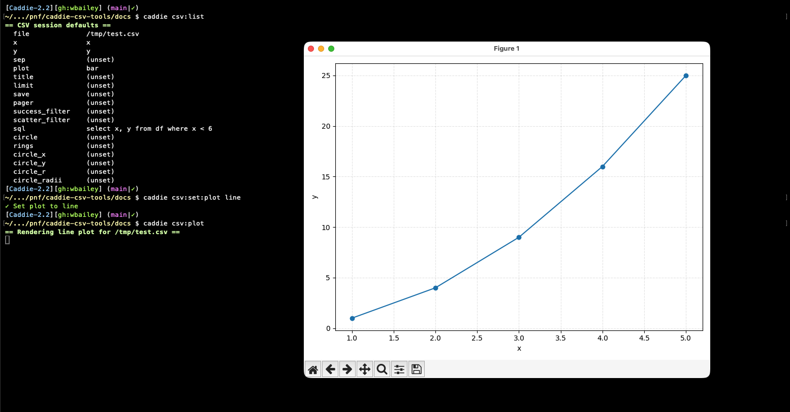

# CSV Module

The CSV module provides fast analytics over CSV/TSV data with DuckDB SQL and optional matplotlib plots. It wraps the
`bin/csvql.py` Python helper to make data analysis effortless and consistent.

## Overview

The CSV module is designed to streamline data analysis workflows by providing:

- **SQL Analytics**: Query CSV/TSV files with familiar SQL syntax using DuckDB backend
- **Visualization**: Create scatter, line, and bar plots with matplotlib
- **Session Management**: Manage default settings via dedicated `csv:set:*`, `csv:get:*`, and `csv:unset:*` commands
- **Saved Sessions**: Capture, list, restore, and delete named configurations
- **Quick Preview**: Inspect the top or bottom of datasets with `csv:head` and `csv:tail`
- **Interactive Paging**: Stream large query results through `less`/`more` (auto-detected) or a custom pager
- **Overlay Features**: Optional circle outlines and concentric rings for highlighting targets or tolerance zones
- **Virtual Environment**: Automatically bootstrap local Python environment with dependencies

## Quick Start

```bash
# Initialize CSV tools
caddie csv:init

# Set up a workflow session
caddie csv:set:file /tmp/test.csv

# Query your data
caddie csv:set:sql 'SELECT x, y FROM df WHERE x < 6'

# Run a query (output opens in your pager automatically)
caddie csv:query

# Summary query 
caddie csv:query:summary

# Create visualizations
caddie csv:set:x x
caddie csv:set:y y
caddie csv:set:plot line
caddie csv:plot 

# Save and restore sessions
caddie csv:session:save "Line chart"
caddie csv:session:list
caddie csv:session:restore 1

# Natural Language Prompts
caddie csv:prompt 'plot /tmp/test.csv scatter x=x y=y where x < 6 title: Less Than Six save session as less_than_6'
```

### Example Usage



## Commands

### Environment Setup

#### `caddie csv:init`

Initialize or update the local csvql virtual environment.

**Examples:**
```bash
# Initialize or update CSV environment (idempotent)
caddie csv:init
```

**What it does:**
- Creates or updates a self-contained Python virtual environment
- Installs required dependencies (DuckDB, pandas, matplotlib)
- Records pinned versions in `requirements.txt`
- Sets up Python environment for CSV operations

**Output:**
```
Setting up csvql environment
✓ csvql environment ready
```

**Requirements:**
- macOS or Linux with Python 3.10+
- Network access for downloading dependencies
- Internet connection for dependency installation

**Idempotent:** Yes - can be run multiple times safely

## Natural-Language Prompts

Turn a short, natural-language request into the exact `caddie csv:*` commands needed to configure a session and render
query results or a plot.

### Mini-Language Grammer

You can combine the supported syntax in any order:

| Feature                 | Syntax                         | Notes                                                |
| ----------------------- | ------------------------------ |----------------------------------------------------- |
| Execution path          | `query` \| `summary` \| `plot` | Determines whether to query or plot the data         |
| CSV file                | `path/to/file.csv`             | First `*.csv` in the prompt is used                  |
| Plot type               | `scatter` \| `line` \| `bar`   | Controls which `csv:*` plot command runs             |
| Axes                    | `x=<col> y=<col>`              | Both required for plotting                           |
| Axis scale              | `x_scale=<mode>` `y_scale=<mode>` | Applies matplotlib scaling (e.g., `linear`, `log`, `symlog`) |
| Axis range              | `x_range=<spec>` `y_range=<spec>` | Comma list with optional brackets/parentheses; blanks mean open bounds |
| Filter → scatter_filter | `where <predicate>`            | Copied verbatim to `csv:set:scatter_filter`          |
| Segment column          | `segment=<column>`             | Sets `csv:set:segment_column` for categorical coloring |
| Segment colors          | `segment_colors <c1,c2,...>`    | Optional palette override mapped to segment values  |
| Title                   | `title: <text>`                | Title set up to the next keyword (e.g., `save to`)   |
| Save path               | `save to path.png`             | Passed to `csv:set:save`. (HTML is allowed for consistency; rendering remains matplotlib.) |
| Define SQL              | `sql: <query>`                 | Passed to `csv:set:sql` (e.g., `sql: select * from df where success=false`) |
| Circle overlay          | `circle at (X,Y) r=R`          | Sets `circle=true`, `circle_x`, `circle_y`, `circle_r`. `(X,Y)` parentheses optional; `r=R` optional |
| Rings overlay           | `rings: r1, r2, r3`            | Enables `rings=true` and sets `circle_radii` (comma-separated) |
| Save session            | `save session as <label>`      | Persists the current defaults                        |
| Dry run                 | `--dry-run` (flag)             | Print commands instead of executing                  |

#### Examples

```bash
# 1) Misses for <=10 HCP, saved as PNG + session
caddie csv:prompt "plot data/30ft_positions.csv scatter x=x_position y=y_position \
where success=false and handicap<=10 \
title: 30ft Misses save to out/30ft.png save session as 30ft_misses"

# 2) Rings + circle overlays
caddie csv:prompt "plot data/25ft.csv scatter x=x_position y=y_position \
rings: 0.5, 1.0, 2.0 circle at (12.5,7.5) r=1.5 \
title: 25ft dispersion save to out/25ft.png"

# 3) SQL slice with save
caddie csv:prompt "plot data/putts.csv scatter x=x_position y=y_position \
sql: select * from df where success=false limit 500 \
title: Misses (first 500) save to out/misses.png"

# 4) Segment by success and clamp ranges
caddie csv:prompt "plot data/15ft.csv scatter x=x_position y=y_position \
segment=success segment_colors tab:green,tab:orange \
x_range [-3,3] y_range (-3,3) title: Success vs Miss"
```

#### Tips & Edge Cases

* Line continuations: You can split prompts across lines with \. The parser normalizes these.
* Quoting: If your title or SQL contains single quotes, they’re escaped automatically when exported to csv:set:*.
* Order: Keywords can appear in any order; the parser stops each capture at the next keyword it recognizes.
* Non-destructive: csv:prompt begins with csv:unset:all to avoid stale defaults. If you want to keep previous state, re-apply specific keys after running or restore a saved session.

##### What Gets Generated (Dry-Run Example)

Prompt:

```bash
caddie csv:prompt --dry-run "plot data/30ft.csv scatter x=x_position y=y_position \
where success=false and handicap<=10 \
title: 30ft Misses save to out/30ft.png save session as 30ft_misses"
```

Output:

```bash
caddie csv:unset:all
caddie csv:set:file data/30ft.csv
caddie csv:set:plot scatter
caddie csv:set:x x_position
caddie csv:set:y y_position
caddie csv:set:title '30ft Misses'
caddie csv:set:save out/30ft.png
caddie csv:set:scatter_filter 'success=false and handicap<=10'
caddie csv:list
caddie csv:scatter
caddie csv:session:save 30ft_misses
```

### Troubleshooting
* “Plot type not set” → include scatter, line, or bar in your prompt, or run caddie csv:set:plot … first.
* “Set csv axes before plotting” → include x=<col> y=<col> in your prompt, or set them via csv:set:x / csv:set:y.
* No file found → ensure the prompt contains a *.csv path or set a default with csv:set:file.
* Filters not applying → confirm your where predicate matches what your plotting path expects (scatter_filter is set verbatim).

### See Also
```bash
caddie csv:help – command reference
caddie csv:list – current defaults
caddie csv:session:* – save/restore reusable plotting presets
```

### Data Query and Analysis

#### `caddie csv:query [file] [sql] [-- flags]`

Execute SQL queries on CSV/TSV files using DuckDB.

**Arguments:**
- `file`: (optional) Path to CSV/TSV file (uses default if not provided)
- `sql`: (optional) SQL query (uses default if not provided)
- Additional flags passed to csvql.py

**Examples:**
```bash
# Query with default settings
caddie csv:query

# Query specific file
caddie csv:query data.csv

# Custom SQL query
caddie csv:query "SELECT COUNT(*) FROM df"

# Complex analysis
caddie csv:query "SELECT distance, AVG(success_rate) FROM df GROUP BY distance ORDER BY distance"
```

**What it does:**
- Loads CSV/TSV file into DuckDB database
- Executes SQL query against the data
- Returns results in tabular format
- Automatically summarizes large result sets (>20 rows)
- Ignores any configured default plot type so query output stays text-only
- Streams the output through your configured pager for easy navigation

**Output:**
```
distance  avg_success_rate
---------  ---------------
1.5       0.95
4.5       0.72
7.5       0.48
10.5      0.34
15.0      0.19
21.0      0.12
27.0      0.08
35.0      0.04
```

**Requirements:**
- CSV file must have header row
- File must be readable (permissions)
- SQL syntax compatible with DuckDB

#### `caddie csv:query:summary [file] [sql] [-- flags]`

Run the same query pipeline but keep the original summarized output (first and last 10 rows) without invoking a pager.

**Examples:**
```bash
# Quick peek without paging
caddie csv:query:summary

# Target a specific file
caddie csv:query:summary data.csv "SELECT * FROM df WHERE club = '7i'"
```

Use this when you only need a high-level snapshot and do not want to scroll through the full dataset.

#### `caddie csv:plot [file] [output.png] [-- flags]`

Render the active plot type (scatter, line, or bar) using the session defaults defined via `caddie csv:set:*` commands.

**Arguments:**
- `file`: (optional) Path to CSV/TSV file (defaults to `csv:set:file` value when omitted)
- `output.png`: (optional) Output file path for saving plot
- Additional plotting flags forwarded to `csvql.py`

**Examples:**
```bash
# Configure plots once
caddie csv:set:plot scatter
caddie csv:set:x aim_offset_x
caddie csv:set:y aim_offset_y

# Render using defaults
caddie csv:plot

# Override the file and save output
caddie csv:plot data/approach_shots.csv charts/approach.png --limit 200
```

**What it does:**
- Uses the active plot type defined by `csv:set:plot`
- Applies current axis settings (x, y columns)
- Adds overlays (circle, rings) when those defaults are enabled
- Saves to disk when an output path is provided, otherwise shows interactively
- Suppresses table output so plots render immediately

**Requirements:**
- Plot type must be one of `scatter`, `line`, or `bar` (validated by `csv:set:plot`)
- X and Y axis columns must be defined (`caddie csv:set:x` and `caddie csv:set:y`)
- Data columns must exist in the file
- Plotting dependencies must be installed (`caddie csv:init` has been performed)

#### `caddie csv:line [file] [output.png] [-- flags]`

Render a line chart when `caddie csv:set:plot line` is active.

**Examples:**
```bash
caddie csv:set:plot line
caddie csv:line data/progression.csv --title "Progress Over Time"
```

If the plot type is not currently set to `line`, the command explains how to update it.

#### `caddie csv:bar [file] [output.png] [-- flags]`

Render a bar chart when `caddie csv:set:plot bar` is active.

**Examples:**
```bash
caddie csv:set:plot bar
caddie csv:bar data/averages.csv --limit 10 --title "Average Score by Club"
```

#### `caddie csv:scatter [file] [output.png] [-- flags]`

Render a scatter plot without requiring the plot type to be set ahead of time.

**Examples:**
```bash
# Scatter plot with defaults
caddie csv:scatter

# Save to specific file
caddie csv:scatter putt_data.csv output.png

# Custom plot with overlays
caddie csv:scatter --rings --circle-radii "3,6,9" --circle --title "Putting Performance"
```

The scatter command is a compatibility helper; behind the scenes it shares the same plotting path as `csv:plot`.

### Data Preview

#### `caddie csv:head [file] [head options]`

Preview the first rows of a CSV/TSV file using the configured default file or an explicit path.

**Examples:**
```bash
# Preview with default file
caddie csv:set:file approach.csv
caddie csv:head

# Preview a specific file and limit output to 5 rows
caddie csv:head data/shot_log.csv -n 5
```

**What it does:**
- Resolves the active CSV file from the session (or accepts an explicit file path)
- Calls the system `head` command with any additional flags you supply
- Helps quickly inspect the top portion of large datasets before running full queries

**Usage tips:**
- Place the file path before any `head` flags when providing an explicit file (`caddie csv:head file.csv -n 20`)
- Configure a default file with `caddie csv:set:file <path>` to avoid repeated paths

#### `caddie csv:tail [file] [tail options]`

Preview the last rows of a CSV/TSV file, mirroring the behavior of the Unix `tail` command.

**Examples:**
```bash
# Show recent entries using the default file
caddie csv:tail -n 15

# Tail a specific file with follow mode
caddie csv:tail exports/live_metrics.csv -f
```

**What it does:**
- Resolves the CSV file from the session or command arguments
- Invokes the system `tail` command with any additional options
- Useful for checking streamed exports or the most recent rows in append-only data

**Usage tips:**
- Follow mode (`-f`) works the same as the standard `tail` command
- Provide the file path before flags when overriding the default (`caddie csv:tail file.csv -n 50`)

### Session Management

#### `caddie csv:list`

Display all current default values in the shell session.

**Examples:**
```bash
# Show all defaults
caddie csv:list

# Check configuration after setup
caddie csv:set:file data.csv
caddie csv:set:x distance
caddie csv:list
```

**What it does:**
- Lists all supported configuration keys
- Shows current values or "(unset)" status
- Displays settings in organized format
- Helps debug configuration issues

**Output:**
```
CSV session defaults
  file             target/putt_data.csv
  x                target_distance
  y                success_rate
  sep              ,
  plot             (unset)
  title            (unset)
  limit            (unset)
  save             (unset)
  pager            (unset)
  success_filter   (unset)
  scatter_filter   (unset)
  x_scale          (unset)
  y_scale          (unset)
  x_range          (unset)
  y_range          (unset)
  segment_column   (unset)
  segment_colors   (unset)
  sql              (unset)
  circle           (unset)
  rings            (unset)
  circle_x         (unset)
  circle_y         (unset)
  circle_r         (unset)
  circle_radii     (unset)
```

### Configuration Commands

Configuration commands follow the pattern `caddie csv:set:<key>`, `caddie csv:get:<key>`, and `caddie csv:unset:<key>`.

#### File Configuration

##### `caddie csv:set:file <path>`

Set the default CSV/TSV file for the current session.

**Arguments:**
- `path`: Path to CSV/TSV file

**Examples:**
```bash
# Set default file
caddie csv:set:file "target/putting_analysis.csv"

# Set with relative path
caddie csv:set:file "./data/results.tsv"
```

**Output:**
```
✓ Set file to target/putting_analysis.csv
```

##### `caddie csv:get:file`

Show the current default file path.

**Examples:**
```bash
caddie csv:get:file
```

**Output:**
```
file = target/putting_analysis.csv
```

##### `caddie csv:unset:file`

Clear the default file setting.

**Examples:**
```bash
caddie csv:unset:file
```

**Output:**
```
✓ Cleared file
```

#### Plot Configuration

##### `caddie csv:set:x <column>`

Set the X-axis column for plotting.

**Arguments:**
- `column`: Column name for X-axis data

**Examples:**
```bash
# Set distance as X-axis
caddie csv:set:x distance

# Set handicap as X-axis
caddie csv:set:x handicap_level
```

**Output:**
```
✓ Set x to distance
```

##### `caddie csv:set:y <column>`

Set the Y-axis column for plotting.

**Arguments:**
- `column`: Column name for Y-axis data

**Examples:**
```bash
# Set success rate as Y-axis
caddie csv:set:y success_rate

# Set accuracy as Y-axis
caddie csv:set:y accuracy_score
```

**Output:**
```
✓ Set y to success_rate
```

##### `caddie csv:set:plot <type>`

Set the default plot type.

**Arguments:**
- `type`: Plot type (`scatter`, `line`, or `bar`)

**Examples:**
```bash
# Set scatter as default
caddie csv:set:plot scatter

# Set line plot
caddie csv:set:plot line

# Set bar chart
caddie csv:set:plot bar
```

**Output:**
```
✓ Set plot to scatter
```

#### Advanced Configuration

##### `caddie csv:set:sql <query>`

Set the default SQL query for data analysis.

**Arguments:**
- `query`: SQL query string

**Examples:**
```bash
# Set default query
caddie csv:set:sql "SELECT distance, COUNT(*) as attempts, AVG(success) as rate FROM df GROUP BY distance"

# Complex query
caddie csv:set:sql "SELECT * FROM df WHERE handicap <= 15 AND distance > 10 ORDER BY distance"
```

**Output:**
```
✓ Set sql to SELECT distance, COUNT(*) as attempts, AVG(success) as rate FROM df GROUP BY distance
```

When a default SQL query is configured, the interactive prompt shows a dedicated `[csv:sql …]` line between the banner and working-directory segments so you always know which query will run.

##### `caddie csv:sql`

Open a nested SQL prompt inside the `caddie csv` mode that accepts multi-line input (similar to `psql` or `mysql`).
Terminate statements with `;` or send them explicitly with `\g`. The prompt automatically persists the SQL in the
current session and runs `csv:query`; use `\summary` to jump straight to `csv:query:summary`.

**Interactive flow:**
```text
caddie> csv
caddie[csv]-1.4> sql
caddie[csv sql]-1.4> SELECT distance,
...>        AVG(success) AS make_rate
...>   FROM df
...>   GROUP BY distance;
```

**Prompt commands:**
- `\q` / `\quit` – leave the SQL prompt
- `\g` / `\go` – execute the current buffer (uses the existing buffer or the last stored SQL)
- `\summary` – execute the buffer with `csv:query:summary`
- `\show` – display current CSV defaults (`csv:list`)
- `\last` – load the last executed SQL statement into the buffer
- `\history` – show command history list or load specific command (`\history N`)
- `\hist` – alias for `\history`
- `\up` / `\down` – navigate through command history sequentially
- `\paste` – enter clean multiline paste mode for complex queries
- `\edit` / `\e` – open current buffer in external editor for complex SQL composition
- `\clear` – discard the in-flight buffer
- `\help` – show the full command reference

**NEW in v1.5 - Enhanced History Navigation:**
- SQL commands are stored in a dedicated history (separate from shell history)
- Use `\up`/`\down` to navigate through previous commands sequentially
- Use `\history N` to jump directly to a specific command by number
- Use `\paste` for clean multiline paste without ugly prompts
- All executed queries are automatically saved to history

**NEW in v2.0 - External Editor Integration:**
- Use `\edit` or `\e` to open current SQL buffer in your configured editor
- Requires `$EDITOR` environment variable to be set (e.g., `export EDITOR=vim`)
- Full-featured SQL editing with syntax highlighting and advanced features
- Automatic buffer update and execution after saving and exiting editor
- Seamless integration with your preferred development workflow

##### `caddie csv:set:pager <command>`

Control which pager is used for full query output. When unset, caddie prefers `less` (if installed), then `more`, and finally falls back to `cat`.
When `less` is auto-detected and `$LESS` is unset, the module runs it with `-R -F -X` so the results stay on the current screen and `less` exits automatically when the content fits one page.

**NEW in v1.5 - Improved Pager Experience:**
- Graceful handling when exiting pagers (no more "broken pipe" errors)
- Clean exit when pressing 'q' in `less` or other pagers
- Professional user experience with no ugly error messages

**NEW in v1.6 - Complete Error Protection:**
- Fixed remaining broken pipe error in empty result sets
- All print statements now protected from pager exit scenarios
- Robust error handling for all query output types

**Examples:**
```bash
# Force use of less
caddie csv:set:pager less

# Switch to more
caddie csv:set:pager more
```

**Output:**
```
✓ Set pager to less
```

##### `caddie csv:get:pager`

Show the currently configured pager or indicate that auto-detection is in effect.

##### `caddie csv:unset:pager`

Remove the custom pager override and return to auto-detected behavior.

##### `caddie csv:set:sep <separator>`

Set the field separator for CSV/TSV files.

**Arguments:**
- `separator`: Field separator (comma, tab, semicolon, etc.)

**Examples:**
```bash
# Default comma separator
caddie csv:set:sep ","

# Tab-separated values
caddie csv:set:sep "\t"

# Semicolon separator
caddie csv:set:sep ";"
```

**Output:**
```
✓ Set csv to ,
```

##### `caddie csv:set:limit <rows>`

Set the row limit for plotting operations.

**Arguments:**
- `rows`: Maximum number of rows to plot

**Examples:**
```bash
# Limit to 1000 rows
caddie csv:set:limit 1000

# Limit to 500 rows
caddie csv:set:limit 500
```

**Output:**
```
✓ Set limit to 1000
```

##### `caddie csv:set:title <text>`

Set the default plot title.

**Arguments:**
- `text`: Title text for plots

**Examples:**
```bash
# Set descriptive title
caddie csv:set:title "Putting Performance Analysis"

# Set title with variables
caddie csv:set:title "Shot Dispersion by Distance"
```

**Output:**
```
✓ Set title to Putting Performance Analysis
```

#### Filter Configuration

##### `caddie csv:set:success_filter <predicate>`

Set SQL predicate for filtering successful shots.

**Arguments:**
- `predicate`: SQL WHERE condition for success filtering

**Examples:**
```bash
# Filter for successful shots only
caddie csv:set:success_filter "success = true"

# Filter for short putts
caddie csv:set:success_filter "distance <= 5 AND success = true"

# Complex filter
caddie csv:set:success_filter "made_putt = 1 OR distance_to_hole <= 1.0"
```

**Output:**
```
✓ Set success filter to success = true
```

##### `caddie csv:set:scatter_filter <predicate>`

Set SQL predicate for filtering scatter plot data.

**Arguments:**
- `predicate`: SQL WHERE condition for scatter plot filtering

**Examples:**
```bash
# Filter recent data only
caddie csv:set:scatter_filter "date >= '2024-01-01'"

# Filter specific handicap range
caddie csv:set:scatter_filter "handicap BETWEEN 10 AND 20"

# Filter outliers
caddie csv:set:scatter_filter "distance_to_hole < 50"
```

**Output:**
```
✓ Set scatter filter to handicap BETWEEN 10 AND 20
```

##### `caddie csv:set:segment_column <column>`

Assign a categorical column that will be used to color scatter plot points.

**Arguments:**
- `column`: Column name in the result set that contains categorical values (NULL permitted)

**Examples:**
```bash
# Color scatter points by success flag
caddie csv:set:segment_column success

# Track make/miss column
caddie csv:set:segment_column made_putt
```

**Output:**
```
✓ Set segment column to success
```

##### `caddie csv:set:segment_colors <color1,color2,...>`

Override the default color palette for the segment column.

**Arguments:**
- `color1,color2,...`: Comma-separated matplotlib colors or hex codes (provide at least as many colors as distinct segment values)

**Examples:**
```bash
# Use custom colors for success/failure
caddie csv:set:segment_colors "tab:green,tab:red"

# Hex color codes are supported
caddie csv:set:segment_colors "#2ca02c,#d62728"
```

**Output:**
```
✓ Set segment colors to tab:green,tab:red
```

#### Axis Scale Configuration

##### `caddie csv:set:x_scale <scale>`

Set the matplotlib scale for the x-axis.

**Arguments:**
- `scale`: Any valid matplotlib scale mode (`linear`, `log`, `symlog`, `logit`, etc.)

**Examples:**
```bash
# Use logarithmic x-axis
caddie csv:set:x_scale log

# Reset to linear scaling
caddie csv:set:x_scale linear
```

##### `caddie csv:set:y_scale <scale>`

Set the matplotlib scale for the y-axis.

**Arguments:**
- `scale`: Any valid matplotlib scale mode

**Examples:**
```bash
# Highlight large misses with a log scale
caddie csv:set:y_scale log

# Customise per-plot on the command line
caddie csv:plot --y-scale symlog
```

##### `caddie csv:set:x_range <start,end[,ticks...]>`

Override the plotted extent for the x-axis.

**Arguments:**
- `start,end[,ticks...]`: Comma-separated values; wrap in `[]`/`()` for readability, leave a side blank for open bounds

**Examples:**
```bash
# Clamp to 0–50 feet
caddie csv:set:x_range [0,50]

# Auto lower bound, cap the top at 25
caddie csv:set:x_range (,25]

# Include an intermediate tick at 12 while keeping auto upper bound
caddie csv:set:x_range [0,12,]
```
Intermediate values between the first and last entry become explicit tick marks. Brackets vs parentheses are cosmetic; both select the same behaviour, but parentheses can signal an open bound when reading the spec back later.

##### `caddie csv:set:y_range <start,end[,ticks...]>`

Override the plotted extent for the y-axis.

**Arguments:**
- `start,end[,ticks...]`: Same format as `x_range`

**Examples:**
```bash
# Force the y-axis to show from -15 to 15
caddie csv:set:y_range (-15,15)

# Leave the upper bound automatic while setting a floor
caddie csv:set:y_range [0,]

# Provide explicit ticks at 0, 5, and 10 feet
caddie csv:set:y_range [0,5,10]
```
As with `x_range`, inner values map to ticks while the outer values act as bounds when provided. Leaving either side blank keeps matplotlib's automatic bound on that edge.

#### Circle Overlay Configuration

##### `caddie csv:set:circle <on|off>`

Enable or disable circle overlay overlay on plots.

**Arguments:**
- `on|off`: Enable or disable circle overlay

**Examples:**
```bash
# Enable circle overlay
caddie csv:set:circle on

# Disable circle overlay
caddie csv:set:circle off
```

**Output:**
```
✓ Set circle to on
```

##### `caddie csv:set:rings <on|off>`

Enable or disable bullseye ring overlay on plots.

**Arguments:**
- `on|off`: Enable or disable ring overlay

**Examples:**
```bash
# Enable rings
caddie csv:set:rings on

# Disable rings
caddie csv:set:rings off
```

**Output:**
```
✓ Set rings to on
```

##### `caddie csv:set:circle_x <value>`

Set the X position for circle center in plots.

**Arguments:**
- `value`: X coordinate for circle center

**Examples:**
```bash
# Set circle at origin
caddie csv:set:circle_x 0

# Set circle offset
caddie csv:set:circle_x 15.5
```

**Output:**
```
✓ Set circle x to 0
```

##### `caddie csv:set:circle_y <value>`

Set the Y position for circle center in plots.

**Arguments:**
- `value`: Y coordinate for circle center

**Examples:**
```bash
# Set circle at origin
caddie csv:set:circle_y 0

# Set circle offset
caddie csv:set:circle_y 22.3
```

**Output:**
```
✓ Set circle y to 0
```

##### `caddie csv:set:circle_r <radius>`

Set the circle radius for overlay plots.

**Arguments:**
- `radius`: Circle radius in the same units as your dataset

**Examples:**
```bash
# Circle with radius 2.0
caddie csv:set:circle_r 2

# Custom radius
caddie csv:set:circle_r 1.5
```

**Output:**
```
✓ Set circle r to 2
```

##### `caddie csv:set:circle_radii <r1,r2,...>`

Set radii for bullseye rings overlay.

**Arguments:**
- `r1,r2,...`: Comma-separated list of ring radii

**Examples:**
```bash
# Training targets at 3, 6, 9 feet
caddie csv:set:circle_radii "3,6,9"

# Precision rings at 1.5, 3 feet
caddie csv:set:circle_radii "1.5,3"

# Multiple targets
caddie csv:set:circle_radii "2,4,6,8,10"
```

**Output:**
```
✓ Set ring radii to 3,6,9
```

### Session Persistence

#### `caddie csv:unset:all`

Clear every CSV session default in one command. Useful when switching data sets or starting a fresh analysis.

```bash
caddie csv:unset:all
```

#### `caddie csv:session:save [label]`

Persist the current defaults (file, axes, filters, plot metadata, etc.) with an optional label. Sessions are stored
under `~/.caddie_csv/sessions`.

```bash
caddie csv:session:save "Dispersion"
```

#### `caddie csv:session:list`

Display saved sessions with their numeric id, label, and timestamp.

```bash
caddie csv:session:list
```

#### `caddie csv:session:view <id>`

Inspect the key/value pairs saved for a specific session.

```bash
caddie csv:session:view 2
```

#### `caddie csv:session:restore <id>`

Load a saved session, clearing existing defaults first.

```bash
caddie csv:session:restore 1
```

#### `caddie csv:session:delete <id>`

Remove a saved session permanently.

```bash
caddie csv:session:delete 3
```

#### `caddie csv:session:delete:all`

Remove every saved session snapshot.

```bash
caddie csv:session:delete:all
```

## Environment Variables

All CSV module settings map to environment variables with the `CADDIE_CSV_` prefix:

| Key | Environment Variable | Purpose |
|-----|---------------------|---------|
| `file` | `CADDIE_CSV_FILE` | Default CSV/TSV file path |
| `x` | `CADDIE_CSV_X` | X-axis column for plots |
| `y` | `CADDIE_CSV_Y` | Y-axis column for plots |
| `sep` | `CADDIE_CSV_SEP` | Field separator |
| `plot` | `CADDIE_CSV_PLOT` | Default plot type |
| `title` | `CADDIE_CSV_TITLE` | Default plot title |
| `limit` | `CADDIE_CSV_LIMIT` | Row limit for plots |
| `save` | `CADDIE_CSV_SAVE` | Default output file path |
| `pager` | `CADDIE_CSV_PAGER` | Preferred pager for `csv:query` |
| `sql` | `CADDIE_CSV_SQL` | Default SQL query |
| `success_filter` | `CADDIE_CSV_SUCCESS_FILTER` | sql predicate for success filtering |
| `scatter_filter` | `CADDIE_CSV_SCATTER_FILTER` | SQL predicate for scatter plot filtering |
| `x_scale` | `CADDIE_CSV_X_SCALE` | Matplotlib scale for x-axis |
| `y_scale` | `CADDIE_CSV_Y_SCALE` | Matplotlib scale for y-axis |
| `x_range` | `CADDIE_CSV_X_RANGE` | Axis bounds and ticks override for x-axis |
| `y_range` | `CADDIE_CSV_Y_RANGE` | Axis bounds and ticks override for y-axis |
| `segment_column` | `CADDIE_CSV_SEGMENT_COLUMN` | Categorical column used to color scatter plots |
| `segment_colors` | `CADDIE_CSV_SEGMENT_COLORS` | Custom colors for segment groups (comma-separated) |
| `circle` | `CADDIE_CSV_CIRCLE` | Enable circle overlay |
| `rings` | `CADDIE_CSV_RINGS` | Enable ring overlay |
| `circle_x` | `CADDIE_CSV_CIRCLE_X` | Circle center X position |
| `circle_y` | `CADDIE_CSV_CIRCLE_Y` | Circle center Y position |
| `circle_r` | `CADDIE_CSV_CIRCLE_R` | Circle radius |
| `circle_radii` | `CADDIE_CSV_CIRCLE_RADII` | Circle radii (comma-separated) |

# Check configuration
```bash
caddie csv:list
```

**Note:** Environment variables persist only for the current shell session and are not saved globally.

## Plot Types

### Scatter Plots

Scatter plots show the relationship between two continuous variables.

```bash
# Create scatter plot
caddie csv:set:plot scatter
caddie csv:set:x distance
caddie csv:set:y success_rate
caddie csv:plot

# Color-code makes vs misses
caddie csv:set:segment_column success
caddie csv:set:segment_colors "tab:green,tab:orange"    # optional override
caddie csv:plot

# Combine with log scaling to emphasise dispersion tails
caddie csv:set:x_scale log
caddie csv:set:y_scale log
caddie csv:plot --title "Log-scale dispersion"

# Clamp the view to ±3 feet on both axes
caddie csv:set:x_range [-3,3]
caddie csv:set:y_range (-3,3)
caddie csv:plot --title "Centered dispersion window"
```

When a segment column is set, the tool automatically renders each distinct value
with a distinct color (teal/orange/purple by default, expanding via Matplotlib palettes when more are needed) and adds a legend. Missing values
are shown in grey so they remain easy to spot without overwhelming the chart.

### Line Plots

Line plots connect data points to show trends over a continuous axis.

```bash
# Create line plot
caddie csv:set:plot line
caddie csv:set:x distance
caddie csv:set:y avg_attempts
caddie csv:line --title "Putting Efficiency by Distance"
```

### Bar Charts

Bar charts display categorical data with rectangular bars.

```bash
# Create bar chart
caddie csv:set:plot bar
caddie csv:set:x handicap_range
caddie csv:set:y avg_score
caddie csv:plot --title "Average Score by Handicap"
```

## Overlay Features

### Circle Outline Overlay

Add a circle representing the target circle to your plots:

```bash
# Enable circle overlay
caddie csv:set:circle on
caddie csv:set:circle_x 0
caddie csv:set:circle_y 0
caddie csv:set:circle_r 2.125  # Standard target circle radius
caddie csv:scatter --title "Shot Dispersion Around Circle"
```

### Bullseye Rings Overlay

Add concentric rings for target practice visualization:

```bash
# Enable rings with training targets
caddie csv:set:rings on
caddie csv:set:circle_radii "3,6,9"  # 3, 6, and 9 foot rings
caddie csv:scatter --title "Putting Accuracy Training"
```

### Combined Overlays

Use both circle and ring overlays together:

```bash
# Enable both overlays
caddie csv:set:circle on
caddie csv:set:rings on
caddie csv:set:circle_r 2.125
caddie csv:set:circle_radii "1,3,5"
caddie csv:scatter --title "Complete Putting Analysis"
```

## File Formats

### Supported Formats

| Format | Extension | Separator | Notes |
|--------|-----------|-----------|-------|
| CSV | `.csv` | Comma (`,`) | Standard CSV format |
| TSV | `.tsv` | Tab (`\t`) | Tab-separated values |
| Custom | Any | User-defined | Use `caddie csv:set:sep` |

### Required Format

- Must **have** header row with column names defined
- Consistent separator throughout file
- Numeric data should be numeric (no quotes for numbers)
- Missing values can be empty fields or "NULL"

### Example CSV Format

```csv
distance,handicap,success,x_position,y_position,distance_to_hole
10.5,15,true,0.2,-1.5,1.8
15.0,20,false,2.3,1.1,2.6
7.5,5,true,-0.8,0.3,0.9
```

## SQL Support

The CSV module uses DuckDB for SQL queries, providing extensive SQL support including:

### Basic Operations

```sql
-- Select specific columns
SELECT distance, success FROM df

-- Filter data
SELECT * FROM df WHERE handicap < 15

-- Aggregate statistics
SELECT distance, COUNT(*), AVG(success_rate) FROM df GROUP BY distance

-- Order results
SELECT * FROM df ORDER BY distance DESC

-- Limit results
SELECT * FROM df LIMIT 100
```

### Advanced Operations

```sql
-- Conditional aggregation
SELECT 
    handicap_range,
    COUNT(*) as total_shots,
    SUM(CASE WHEN success = true THEN 1 ELSE 0 END) as successful_shots,
    AVG(distance_to_hole) as avg_distance_to_hole
FROM df 
GROUP BY handicap_range

-- Window functions
SELECT 
    distance,
    success_rate,
    AVG(success_rate) OVER (ORDER BY distance ROWS BETWEEN 2 PRECEDING AND 2 FOLLOWING) as moving_avg
FROM df

-- Complex filtering
SELECT * FROM df 
WHERE (handicap BETWEEN 10 AND 20) 
  AND (distance > 5 AND distance < 20)
  AND (distance_to_hole < 3)
```

### DuckDB-Specific Features

```sql
-- String operations
SELECT UPPER(handicap_category), LENGTH(player_name) FROM df

-- Date/time operations
SELECT DATE_TRUNC('day', shot_timestamp), COUNT(*) FROM df GROUP BY 1

-- Mathematical functions
SELECT SQRT(x_position*x_position + y_position*y_position) as euclidean_distance FROM df

-- Statistical functions
SELECT STDDEV(distance_to_hole), VARIANCE(success_rate) FROM df
```

## Error Handling

### Common Errors

#### "Error: CSV file required"
**Cause**: No default file set and none provided
**Solution**: Set a default file or provide file path explicitly

```bash
caddie csv:set:file path/to/data.csv
# OR
caddie csv:query path/to/data.csv
```

#### "Error: Plotting requires both --x and --y"
**Cause**: X or Y axis column not defined
**Solution**: Set both axes before plotting

```bash
caddie csv:set:x distance
caddie csv:set:y success_rate
caddie csv:scatter
```

#### "Error: Missing columns in result set"
**Cause**: Referenced column doesn't exist in data
**Solution**: Check your SQL query and file structure

```bash
# Check available columns first
caddie csv:query "PRAGMA table_info(df)"
# Or
caddie csv:query "SELECT * FROM df LIMIT 1"
```

#### "Error: csvql.py not found"
**Cause**: CSV module not properly installed
**Solution**: Reinstall caddie modules

```bash
cd /path/to/caddie-csv-tools
make install
caddie reload
```

#### "Error: Pipeline failed"
**Cause**: Python virtual environment issues
**Solution**: Reinitialize CSV environment

```bash
caddie csv:init
```

#### "Error: Invalid ring radius"
**Cause**: Non-numeric value in circle_radii
**Solution**: Use comma-separated numeric values

```bash
caddie csv:set:circle_radii "3,6,9"  # Correct
# NOT (comma space): caddie csv:set:circle_radii "3, 6, 9 feet"
```

### Error Output Format

All errors follow a consistent format:
```
Error: <description>
Usage: caddie csv:<command> <arguments>
```

## Troubleshooting

### Virtual Environment Issues

If CSV operations fail due to Python environment problems:

```bash
# Reinitialize environment
caddie csv:init

# Check Python installation
python3 --version
```

### Dependency Installation Failures

If dependency installation fails:

```bash
# Check network connectivity
ping pypi.org

# Check pip availability
python3 -m pip --version

# Clean and retry
rm -rf ~/.caddie_modules/bin/.caddie_venv
caddie csv:init
```

### Large File Performance

For large csv files (>100MB):

```bash
# Set reasonable limits
caddie csv:set:limit 10000

# Use specific filters to reduce data
caddie csv:set:success_filter "distance <= 20"

# Consider preprocessing with external tools
head -1000 large_file.csv > sample.csv
caddie csv:set:file sample.csv
```

### Memory Issues

If running out of memory with large datasets:

```bash
# Reduce plot data size
caddie csv:set:limit 5000

# Use SQL aggregation to reduce rows
caddie csv:query "SELECT distance, AVG(success_rate) FROM df GROUP BY distance"
```

### Plotting Issues

If plots don't display or save correctly:

```bash
# Check matplotlib backend
python3 -c "import matplotlib; print(matplotlib.get_backend())"

# For saving plots in headless environments
export MPLBACKEND=Agg
caddie csv:scatter --save output.png
```

## Best Practices

### Session Management

1. **Default Setup**: Set commonly used values once at the beginning of a session
2. **Consistent Naming**: Use clear, descriptive column names in your CSV files
3. **Clean Configuration**: Clear unused defaults with `caddie csv:unset:<key>`
4. **Document Settings**: Keep notes on your typical configuration workflows

### Data Quality

1. **Header Validation**: Always ensure CSV files have proper headers
2. **Numeric Data**: Ensure numeric columns contain numbers, not quoted strings
3. **Missing Values**: Decide on handling strategy for missing data (empty, "NULL", etc.)
4. **Consistent Format**: Use consistent separators and formatting throughout

### SQL Optimization

1. **Filter Early**: Use WHERE clauses to reduce data before processing
2. **Aggregate Appropriately**: Use GROUP BY for summarizing trends
3. **Limit Results**: Use LIMIT for large datasets
4. **Index-Friendly**: Structure queries to work efficiently with DuckDB

### Visualization Best Practices

1. **Meaningful Axes**: Choose axes that reveal insights about your data
2. **Appropriate Scales**: Use log scales for wide-ranging data
3. **Context Overlays**: Use circle and ring overlays for diagram-specific analysis
4. **Clear Titles**: Always provide meaningful plot titles

### Performance Optimization

1. **Session Defaults**: Set defaults rather than specifying everything each time
2. **Data Filtering**: Use filters to reduce data volume when possible
3. **Plot Limits**: Use reasonable limits for plot operations
4. **Batch Operations**: Group multiple queries together when possible

## Examples

### Development Testing Workflow

```bash
#!/bin/bash
# quick-csv-test.sh

# Test CSV functionality
caddie csv:init

# Create test data
cat > test_data.csv << EOF
distance,handicap,success,x_position,y_position,distance_to_hole
5.0,10,true,0.5,-0.8,0.9
10.0,15,false,2.1,1.5,2.6
15.0,20,false,-1.2,0.3,1.2
3.0,5,true,-0.3,-0.1,0.3
EOF

# Test basic query
caddie csv:query test_data.csv "SELECT COUNT(*) FROM df"

# Test plotting
caddie csv:set:file test_data.csv
caddie csv:set:x distance
caddie csv:set:y distance_to_hole
caddie csv:scatter --save test_plot.png

# Test filters
caddie csv:query "SELECT * FROM df WHERE handicap <= 15"

# Clean up
rm test_data.csv
rm test_plot.png
echo "✓ CSV module test completed successfully"
```

## Related Documentation

- **[Core Module](core.md)** - Basic Caddie.sh functions and debug system
- **[Git Module](git.md)** - Version control for analysis results
- **[Python Module](python.md)** - Python environment that CSV module builds upon

## External Resources

- **[DuckDB Documentation](https://duckdb.org/docs/sql/introduction)** - SQL reference for the csv module's query engine
- **[matplotlib Documentation](https://matplotlib.org/stable/index.html)** - Plotting library used by CSV module
- **[pandas Documentation](https://pandas.pydata.org/docs/)** - Data manipulation library used internally

---

*The CSV module provides everything you need for development level data analysis. From simple queries to basic visualizations, it makes data-driven insights accessible and consistent.*
